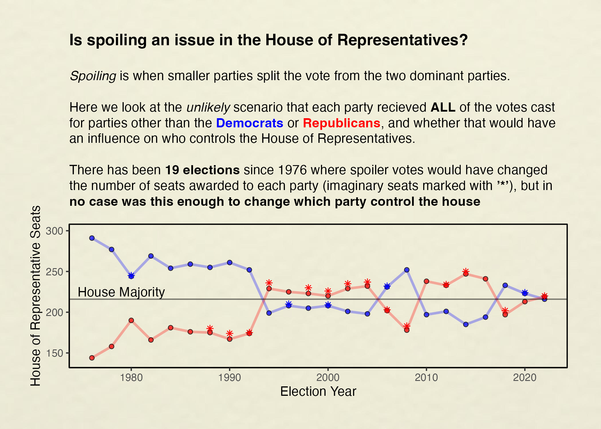
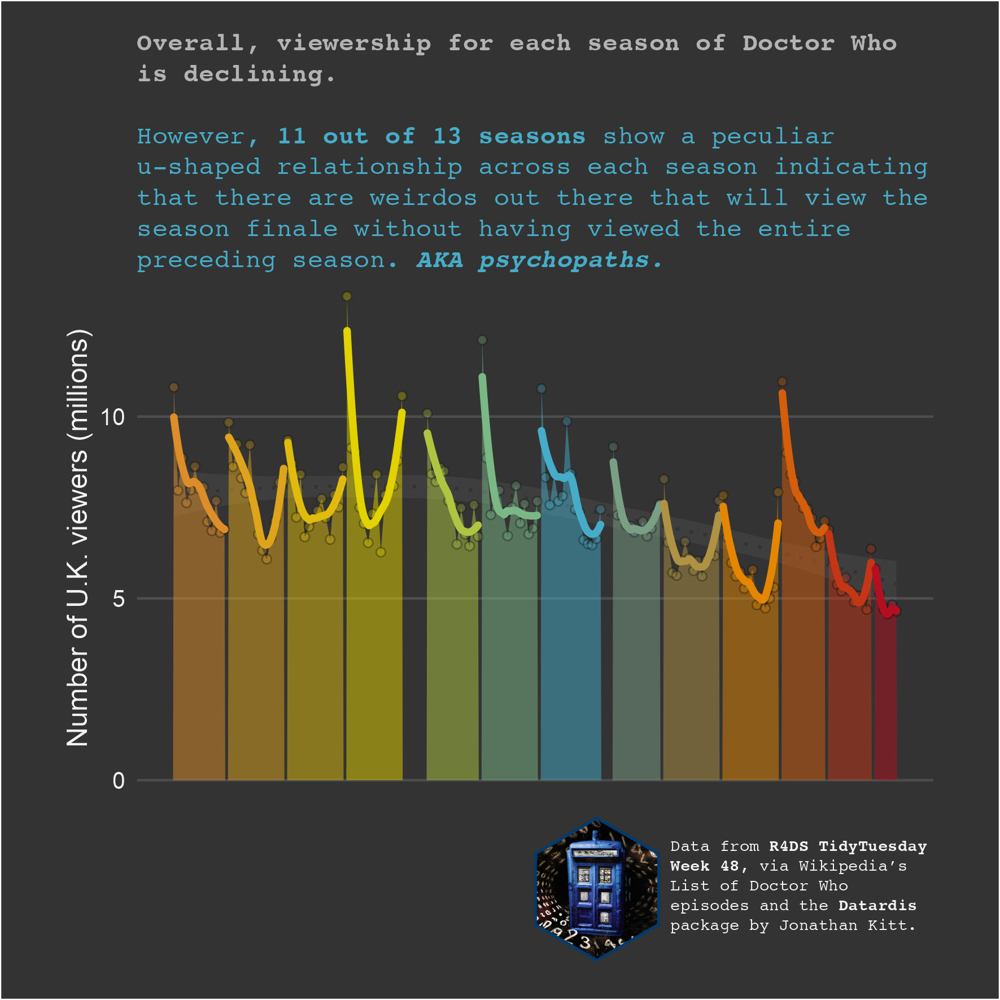
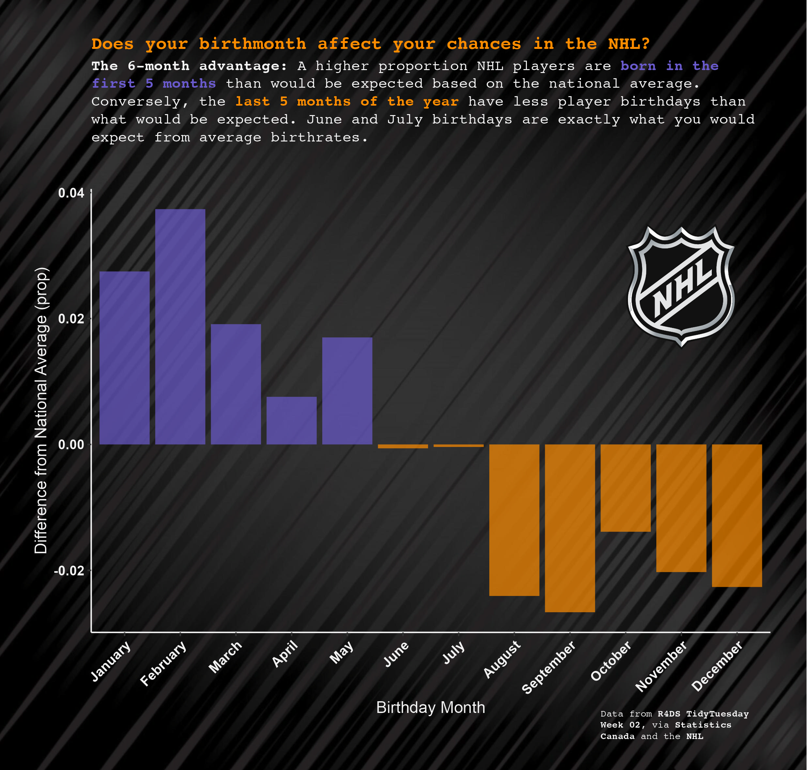
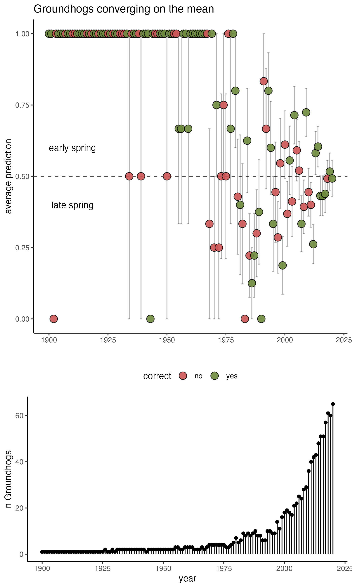

## TidyTuesdays

Playing with datavis every Tuesday\*, using R4DS data. I set a time limit (usually 1 hr), so results here are wherever I got to after that time, and I usually annotate where I would have liked to tweak things further, had I had more time on it.

*\*maybe more like once a month*

# 2023

-   [Week45](code/2023_week45.md): US House of Representatives\
    

-   [Week46](code/2023_week46.rmd): Diwali sales

-   [Week48](code/2023_week48.md): DrWho Episodes\
    

# 2024

-   JANUARY - [Week02](code/2024_week02.md): NHL Player Birthdays\
    

-   FEBRUARY - [Week 04](code/2024_week05.md): Groundhog Day Predictions (work in progress)\
    
