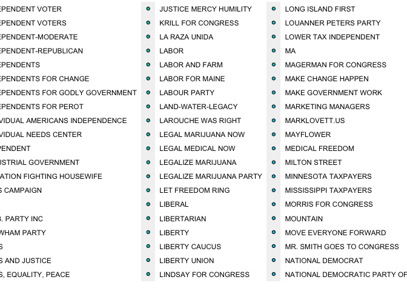
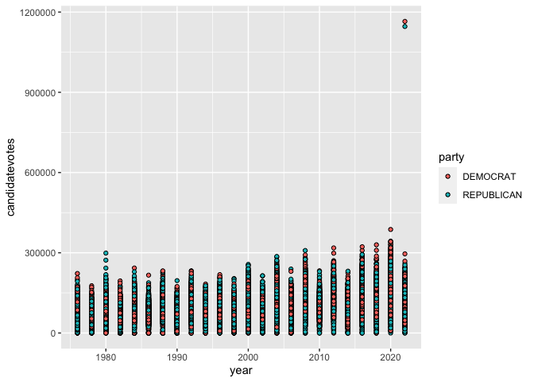
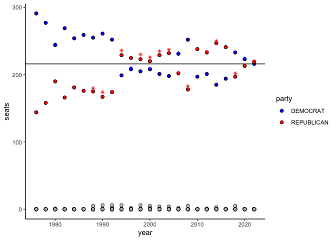
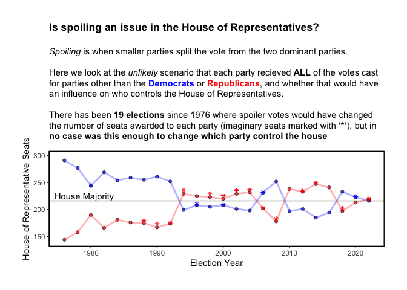
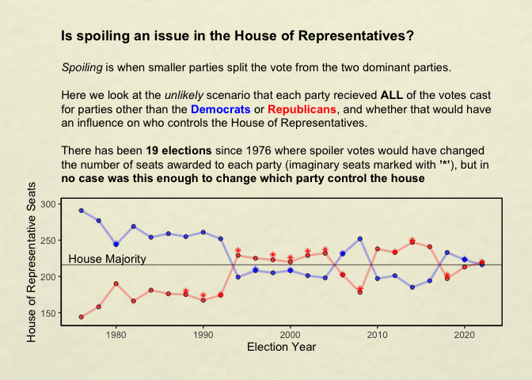

# Setup

    library(tidyverse)

    ## ── Attaching core tidyverse packages ──────────────────────── tidyverse 2.0.0 ──
    ## ✔ dplyr     1.1.2     ✔ readr     2.1.4
    ## ✔ forcats   1.0.0     ✔ stringr   1.5.0
    ## ✔ ggplot2   3.4.2     ✔ tibble    3.2.1
    ## ✔ lubridate 1.9.2     ✔ tidyr     1.3.0
    ## ✔ purrr     1.0.1     
    ## ── Conflicts ────────────────────────────────────────── tidyverse_conflicts() ──
    ## ✖ dplyr::filter() masks stats::filter()
    ## ✖ dplyr::lag()    masks stats::lag()
    ## ℹ Use the conflicted package (<http://conflicted.r-lib.org/>) to force all conflicts to become errors

    library(tidytuesdayR)
    library(ggpubr)
    library(ggimage)

    ## 
    ## Attaching package: 'ggimage'
    ## 
    ## The following object is masked from 'package:ggpubr':
    ## 
    ##     theme_transparent

    tuesdata <- tidytuesdayR::tt_load(2023, week = 45)

    ## --- Compiling #TidyTuesday Information for 2023-11-07 ----
    ## --- There is 1 file available ---
    ## --- Starting Download ---

    ## 
    ##  Downloading file 1 of 1: `house.csv`

    ## --- Download complete ---

    house <- tuesdata$house

# Explore

Let’s explore today’s data and see what we have! Only instructions this
week are to stay clear of **causation**, fair enough!

    house

    ## # A tibble: 32,452 × 20
    ##     year state   state_po state_fips state_cen state_ic office   district stage
    ##    <dbl> <chr>   <chr>         <dbl>     <dbl>    <dbl> <chr>    <chr>    <chr>
    ##  1  1976 ALABAMA AL                1        63       41 US HOUSE 001      GEN  
    ##  2  1976 ALABAMA AL                1        63       41 US HOUSE 001      GEN  
    ##  3  1976 ALABAMA AL                1        63       41 US HOUSE 001      GEN  
    ##  4  1976 ALABAMA AL                1        63       41 US HOUSE 002      GEN  
    ##  5  1976 ALABAMA AL                1        63       41 US HOUSE 002      GEN  
    ##  6  1976 ALABAMA AL                1        63       41 US HOUSE 002      GEN  
    ##  7  1976 ALABAMA AL                1        63       41 US HOUSE 003      GEN  
    ##  8  1976 ALABAMA AL                1        63       41 US HOUSE 003      GEN  
    ##  9  1976 ALABAMA AL                1        63       41 US HOUSE 003      GEN  
    ## 10  1976 ALABAMA AL                1        63       41 US HOUSE 004      GEN  
    ## # ℹ 32,442 more rows
    ## # ℹ 11 more variables: runoff <lgl>, special <lgl>, candidate <chr>,
    ## #   party <chr>, writein <lgl>, mode <chr>, candidatevotes <dbl>,
    ## #   totalvotes <dbl>, unofficial <lgl>, version <dbl>, fusion_ticket <lgl>

    (plot1 <- ggplot(data = house, aes(x=year, y=candidatevotes, fill = party)) +
      geom_point(shape = 21))

Ok, looks like independents really clutter up these data - let’s remove
them to get a better picture

    (plot1 <- ggplot(data = subset(house, party=="DEMOCRAT"|party=="REPUBLICAN"), aes(x=year, y=candidatevotes, fill = party)) +
      geom_point(shape = 21))

Hang on, need to do some reading about US house elections… OK, so to win
the house, you need 216 seats. Each seat belongs to a district and
majority votes in each district decides seat.

Perhaps it would be interesting to see whether third party candidates
have the power to tip the house? so compare the years when independents
or writeins made up the difference for each party controlling th house?

    #overall data
    house_data <- house %>% 
      group_by(year, state, district) %>% 
     mutate(ranked = rank(desc(candidatevotes)),
            won = if_else(ranked == 1, 1, 0)) %>%
      group_by(year, party) %>% 
      summarise(seats = sum(won)) 

    ## `summarise()` has grouped output by 'year'. You can override using the
    ## `.groups` argument.

    # only R vs D
    house_data_twoparty <- house %>% 
      filter(party == "DEMOCRAT" |party == "REPUBLICAN") %>% 
        group_by(year, state, district) %>% 
      select(year, state, district, party, candidatevotes)

    #only other
    house_data_other <- house %>% 
      filter(party != "DEMOCRAT" & party != "REPUBLICAN") %>% 
      select(year, state, district, party, candidatevotes) %>% 
      dplyr::group_by(year, state, district) %>% 
      summarise(candidatevotes = sum(candidatevotes)) %>% 
      mutate (party = "OTHER") 

    ## `summarise()` has grouped output by 'year', 'state'. You can override using the
    ## `.groups` argument.

    #seats awarded to each if recieved all 'other' votes
    house_data_spoiler <- as.data.frame(house_data_other) %>% 
      add_row(house_data_twoparty) %>%
      pivot_wider(names_from = party, values_from = candidatevotes, values_fn = sum, values_fill = 0) %>% 
      mutate(D = (DEMOCRAT + OTHER),
             R = (REPUBLICAN + OTHER),
             Dwin = if_else(D>R, 1, 0),
             Rwin = if_else(R>D, 1, 0)) %>% 
      group_by(year) %>% 
      summarise(REPUBLICAN = sum(Rwin),
                DEMOCRAT = sum(Dwin)) %>% 
      pivot_longer(2:3, names_to = 'party', values_to = "seats")

    #which years are a spoiler year, and in what direction?  
    house_data_comp <-  house_data %>% 
      filter(party == "DEMOCRAT" |party == "REPUBLICAN") %>% 
      right_join(house_data_spoiler, by = c("year", "party")) %>% 
      mutate(spoil = if_else(seats.y>seats.x, seats.y,NA),
             imp = if_else(spoil==1 & seats.x<=216 & seats.y>216, 1, NA)) 
      
    #let's plot!
    ggplot(house_data, aes(x = year, y = seats)) +
      geom_point(shape = 21, size =2, alpha = 0.8, fill = "grey")+
      geom_point(data = subset(house_data, party == "REPUBLICAN"|party== "DEMOCRAT"), aes(x=year, y=seats, fill = party), shape = 21, size =2)+
        geom_hline(yintercept = 216)+
      geom_point(data = house_data_comp, aes(x=year, y=spoil, colour = party), shape =8)+
        theme(legend.position="none")+
      scale_fill_manual(values = c("blue", "red"))+
      scale_colour_manual(values = c("blue", "red"))+

      theme_classic()

    ## Warning: Removed 29 rows containing missing values (`geom_point()`).

Ok, so now we have the data we want, let’s make it pretty! I feel like
we might not need to include the others

    # Import the image
    library(magick)

    ## Linking to ImageMagick 6.9.12.3
    ## Enabled features: cairo, fontconfig, freetype, heic, lcms, pango, raw, rsvg, webp
    ## Disabled features: fftw, ghostscript, x11

    img <- image_read("../data/watercolourpaper.jpg") %>% 
      image_blur(3, 3) %>%
      image_colorize(opacity = 70, color = "beige")
    image_write(img, "../data/bg.jpg")

    caption <- (" *Spoiling* is when smaller parties split the vote from the two dominant parties.   Here we look at the *unlikely* scenario that each party recieved **ALL** of the votes cast for parties other than the **Democrats** or **Republicans**, and whether that would have an influence on who controls the House of Representatives.     There has been **19 elections** since 1976 where spoiler votes would have changed the number of seats awarded to each party (imaginary seats marked with **'*'**), but in **no case was this enough to change which party control the house** ")

    library(png)
    library(ggtext)
    library(patchwork)

    img2 = image_read("../data/R.jpg")

    (spoiler_elections <- ggplot(house_data, aes(x = year, y = seats)) +
      geom_line(data = subset(house_data, party == "REPUBLICAN"|party== "DEMOCRAT"), aes(x=year, y=seats, colour = party), alpha = 0.3, size = 1 )+
       geom_point(data = subset(house_data, party == "REPUBLICAN"|party== "DEMOCRAT"), aes(x=year, y=seats, fill = party), shape = 21, linewidth =1, alpha = 0.7)+
        geom_hline(yintercept = 216, alpha = 0.5)+
      geom_point(data = house_data_comp, aes(x=year, y=spoil, colour = party), shape =8)+
        annotate("text", x=1979, y=225, label = "House Majority")+
        # inset_element(p=img2, top = 1, left = 1, bottom = 1, right = 1)+
       scale_fill_manual(values = c("blue", "red"))+
      scale_colour_manual(values = c("blue", "red"))+
        labs(x = "Election Year", y = "House of Representative Seats",
             title = "Is spoiling an issue in the House of Representatives?",
             subtitle = caption)+
        coord_cartesian(ylim = c(140, 300), 
                          clip = 'off') +
       theme_classic()+
       theme(legend.position = "none",
             panel.border = element_rect(linewidth = 0.5, fill=NA),
             plot.margin = unit(c(1,1,1,1), "cm"),
             plot.title = element_text(face = "bold"),
             plot.subtitle = element_textbox_simple())
         
     )

    ## Warning: Using `size` aesthetic for lines was deprecated in ggplot2 3.4.0.
    ## ℹ Please use `linewidth` instead.
    ## This warning is displayed once every 8 hours.
    ## Call `lifecycle::last_lifecycle_warnings()` to see where this warning was
    ## generated.

    ## Warning in geom_point(data = subset(house_data, party == "REPUBLICAN" | :
    ## Ignoring unknown parameters: `linewidth`

    ## Warning: Removed 29 rows containing missing values (`geom_point()`).

    spoiler_elections

    ## Warning: Removed 29 rows containing missing values (`geom_point()`).

    TT_week45 <-  ggbackground(spoiler_elections, "../data/bg.jpg")

    ## Warning: Removed 29 rows containing missing values (`geom_point()`).

## Final Figure

There we go, final figure! What I like: Answers the questions, in a
simple way What I don’t like: It’s a bit boring?

    ggsave("../figures/TT_week45.jpg", plot = TT_week45)

    ## Saving 7 x 5 in image

    TT_week45

