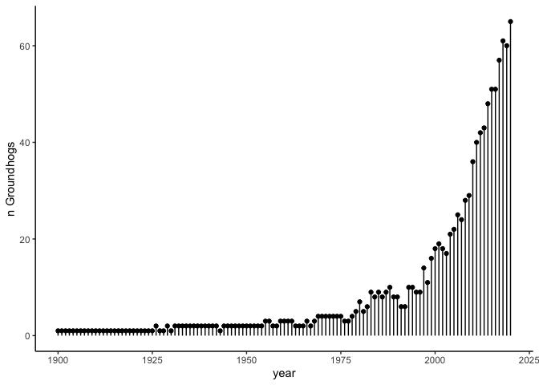

# *Week 05*

## **Setup**

    library(tidytuesdayR)
    library(tidyverse)
    library(janitor)
    library(ggpubr)
    library(knitr)

    tuesdata <- tidytuesdayR::tt_load(2024, week = 05)

    ## 
    ##  Downloading file 1 of 2: `predictions.csv`
    ##  Downloading file 2 of 2: `groundhogs.csv`

## Get data

I want to test how often the groundhogs get it right, so I found an epa
dataset on the arrival of spring (1900-2020), and whether it’s above or
below expected from the 1981-2010 average bloom date

    ## Rows: 121 Columns: 5
    ## ── Column specification ────────────────────────────────────────────────────────
    ## Delimiter: ","
    ## dbl (5): Year, Leaf Mean, Leaf 9-yr normal curve, Bloom Mean, Bloom 9-yr nor...
    ## 
    ## ℹ Use `spec()` to retrieve the full column specification for this data.
    ## ℹ Specify the column types or set `show_col_types = FALSE` to quiet this message.

## Explore \[start hh:mm\]

    early_spring <- leaf %>% 
      clean_names() %>% 
      mutate(early_spring_leaf = if_else(leaf_mean>0, "no", "yes")) %>% 
      select(early_spring_leaf)

    groundhog_success <- predictions %>% 
      group_by(year) %>% 
      summarise(mean_pred = mean(shadow),
                pred_n = length(shadow),
                SEM_pred = sd(shadow)/sqrt(length(shadow))
      ) %>% 
      filter(year<=max(leaf$year) & year>=min(leaf$year)) %>% 
      mutate(early_spring = if_else(mean_pred>0.5, "no",
                                    if_else(mean_pred == 0.5, "split","yes"))) %>% 
      add_column(early_spring) %>% 
      mutate(correct = if_else( early_spring == early_spring_leaf, "yes", "no"))

    groundhog_success %>% 
      group_by(correct) %>% 
      tally()

    ## # A tibble: 2 × 2
    ##   correct     n
    ##   <chr>   <int>
    ## 1 no         49
    ## 2 yes        72

## Final Plot

    (groundhog_preds <- ggplot(data = groundhog_success, aes(x = year, y = mean_pred, fill = correct))+
      geom_hline(yintercept = 0.5, 
                 linetype = "dashed",
                 alpha = 0.7)+
      geom_errorbar(aes(ymin = mean_pred-SEM_pred, ymax = mean_pred + SEM_pred),
                    alpha = 0.3)+
      geom_point(shape = 21, 
                 size = 4,
                 alpha = 0.9) +
      scale_fill_manual(values = c("indianred3", "darkolivegreen4")) +
      labs( y = "average prediction", 
            x = "",
            title = "Groundhogs converging on the mean")+
      annotate("text", x = 1910, y = 0.6, label = "early spring")+
      annotate("text", x = 1910, y = 0.4, label = "late spring")+
      theme_classic()+
      theme(legend.position = "bottom"))

    #hm this is really a story of data converging on the mean? Let's have a look at the number of groundhogs contributing data?

    (groundhog_n <- ggplot(data = groundhog_success, aes(x=year, y=pred_n))+
      geom_point()+
      geom_segment(aes(x = year, xend = year,
                       y = 0, yend = pred_n))+
        labs(y = "n Groundhogs")+
      theme_classic())

    (week05 <- ggarrange(groundhog_preds, groundhog_n, ncol = 1, heights = c(2,1)))

    # ggsave("../figures/TT_Week05.jpg", width = 15, height = 25, units ="cm")
